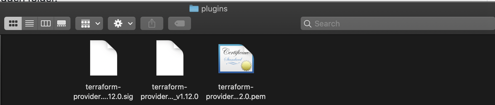

# Automate IBM Cloud Kubernetes Service using Terraform

Terraform is an Open Source software that is developed by HashiCorp that build, change, and version infrastructure safely and efficiently. We can use Terraform to automate IBM Cloud resource provisioning, rapidly build complex, multi-tier cloud environments, and enable Infrastructure as Code (IaC).

The Terraform __configuration files__ describe the resources that you need and how you want to configure them. Based on your configuration, Terraform creates an execution __plan__ and describes the actions that need to be executed to get to the required state. You can review the execution plan, change it, or simply execute the plan. When you change your configuration, Terraform can determine what changed and create incremental execution plans that you can apply to your existing IBM Cloud resources


Steps :
1. Install the Terraform CLI
1. Install IBM Cloud Provider plug-in


## Step 1 : Install the Terraform CLI 
1. Open the terminal and create a folder __terraform__ and navigate into that folder.

   ``` mkdir terraform && cd terraform ```
1. [Download the Terraform CLI version 0.12.x](https://releases.hashicorp.com/terraform/)
1. Extract the Terraform package and copy the binary file into your terraform directory.
1. Point the __$PATH environment__ variable to Terraform binary file.

   ``` export PATH=$PATH:$HOME/terraform ```

1. Run command __terraform__ to verify that the installation is successful
__NOTE:__ Please restart the device if above command is not executed

## Step 2 : Install IBM Cloud Provider plug-in
Terraform uses the IBM Cloud Provider plug-in to securely communicate with the IBM Cloud REST API. To provision and work with IBM Cloud resources,we must install it.

1. [Download the latest version of the IBM Cloud Provider binary package](https://github.com/IBM-Cloud/terraform-provider-ibm/releases)
1. Extract the IBM Cloud Provider package to retrieve the binary file.
1. Create a hidden folder for plug-in

   ``` mkdir $HOME/.terraform.d/plugins ```
   
1. Move the IBM Cloud Provider plug-in into your hidden folder.
   
   ``` mv $HOME/Downloads/terraform-provider-ibm* $HOME/.terraform.d/plugins/ ```
 
__NOTE :__ If there is any issues in the above step kindly manually place binary files under plugins like below image.


   
## Step 3 : Prepare Terraform environment
1. Create [IBM Cloud API key](https://cloud.ibm.com/docs/account?topic=account-userapikey#create_user_key)
1. Then create a Terraform project directory. The directory will hold all Terraform configuration files. (ex terraform_cf)
1. Now in project directory, create a __terraform.tfvars__ file and add the __IBM Cloud API key__ that was created earlier. The terraform.tfvars file is a Terraform variables file that you store on local machine. When you initialize the Terraform CLI, all variables that are defined in this file are automatically loaded into Terraform and then can be referenced  in every Terraform configuration file in the same project directory
1. In the same project directory, create a __provider.tf__ file and configure IBM as Terraform provider
   ```
   variable "ibmcloud_api_key" {}

   provider "ibm" {
   ibmcloud_api_key    = var.ibmcloud_api_key
    }
   ```
## Step 4: Lets create IBM Cloud Foundry resource
1. In the same directory where you stored the __terraform.tfvars__ and __provider.tf__ files, create a Terraform configuration file and name it __configure.tf__
   ```
   data "ibm_space" "space" {
     org   = "mahsankhan@ibm.com"
     space = "dev"
   }

   resource "ibm_app" "app" {
     name                 = "my-app"
     space_guid           = data.ibm_space.space.id
     app_path             = "hello.zip"
     wait_timeout_minutes = 90
     buildpack            = "sdk-for-nodejs"
   }
   ```
   
   The configuration file includes the following definition blocks:
   
   __Data:__ Use this block to retrieve information for an existing resource in your IBM Cloud account.
   
   __Resource__: Every resource block specifies the IBM Cloud resource that needs to provision.
   
    Review the input parameters that you can specify for ibm cloud foundry resource. From [here](https://cloud.ibm.com/docs/terraform?topic=terraform-cloud-foundry-resources#cf-app)
    
    List of all supported configurations for each resource, see [here](https://cloud.ibm.com/docs/terraform?topic=terraform-index-of-terraform-resources-and-data-sources)

## Step 5: Initialize Terraform
1. Must be in Terraform project directory and run command __terraform init__ . This will initialize terraform in the folder and now we can work with all commands to automate our IBM cloud resources.
1. Once above step is executed successfully there will be message "Terraform has been successfully initialized!". If there is any issues please verify above steps

## 6: Execute Plan 
1. 
1. When this command is executed, Terraform validates the syntax of configuration file and resource definitions against the specifications that are provided by the IBM Cloud Provider plug-in


